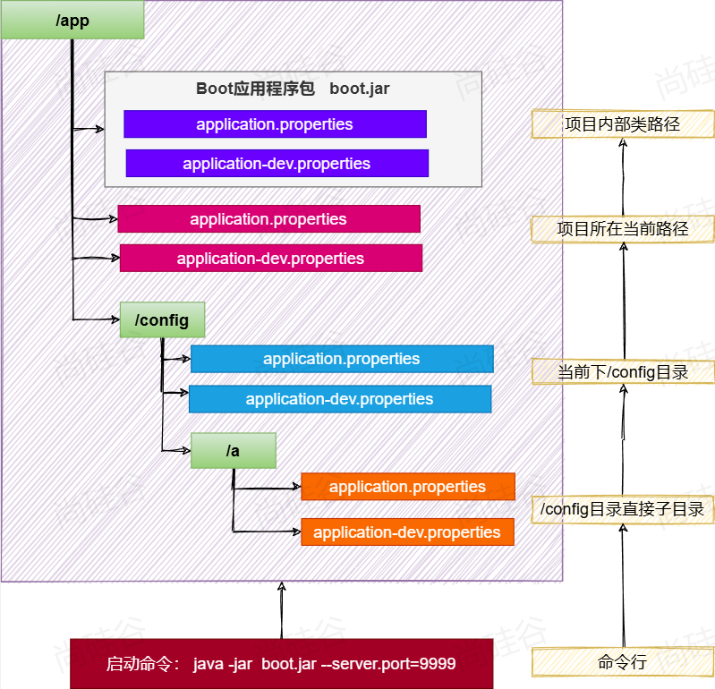

# Spring Boot

## 特性

1. 简化打包。可直打 jar 包，复制粘贴开箱即用。

2. 简化部署。jar 包在服务器上 `java -jar name.jar` 即可启动，仅需要 java 环境支持，无需额外部署 tomcat 等支持。

3. 简化运维。任何在 application.properties 中可修改的配置，都可以在命令行中直接修改。

   如想启动时部署到其他端口号，则 `java -jar name.jar --server.port=9999` 即可完成端口号修改。其余可配置的信息均可如此操作。

   

## 场景启动器

IDEA 下，会根据 starter 中勾选的内容自动添加相应的场景启动器。

如 `spring-boot-starter-web` & `spring-boot-starter-aop`。**每个 starter 中封装了相应场景所需要的所有 jar 包。**

每个场景都有一个基础依赖，`spring-boot-starter`。


## 版本号

每一个 starter 不需要写版本号的原因是，他们有一个共同的父项目，`spring-boot-starter-parent`。

在父项目中也有一个父项目，`spring-boot-dependencies`，该项目中进行了所有版本号的管理。


## 自动配置

> 约定大于配置

- 导入场景，**容器**中就会配置好这个场景的**核心组件**。如 tomcat、SpringMVC、DataSource 等。

- 不喜欢的组件可以自行配置进行替换。

  如，此处示范如何将数据源替换为 druid：

  ```java
  @Configuration
  public class DataSourceConfig {
      @Value("${spring.datasource.url}")
      String url;
      @Value("${spring.datasource.username}")
      String username;
      @Value("${spring.datasource.password}")
      String password;
      @Value("${spring.datasource.driver-class-name}")
      String driverClassName;
  
      @Bean
      public DruidDataSource druidDataSource() {
          DruidDataSource druidDataSource = new DruidDataSource();
          druidDataSource.setUrl(url);
          druidDataSource.setUsername(username);
          druidDataSource.setPassword(password);
          druidDataSource.setDriverClassName(driverClassName);
          return druidDataSource;
      }
  }
  ```

  使用 **@Value(${})** 可获取 application.properties 中的属性

  将 DruidDataSource 装入容器即可完成替换。

### 默认的包扫描规则

Springboot 只会扫描主程序所在的包及其下面的子包。

### 配置默认值

- 配置文件的所有配置项 是和 某个类的对象值一一进行绑定的
- 很多配置即使不写都有默认值，如端口号、字符编码等
- 默认能写的所有配置项可在 [文档](https://docs.spring.io/spring-boot/appendix/application-properties/index.html) 中见

### 按需加载自动配置

- 导入的场景会导入全量自动配置包，但并不是都生效


## 属性绑定

用于将 **容器中** 任意组件的属性值和 **配置文件** 中的配置项进行绑定

1. 给容器中注册组件。

   使用 @Component；或在主程序类上方使用 @EnableConfigurationProperties(Dog.class) 将 Dog 组件的属性绑定开启，此注解亦能将 Dog 组件放入容器中。

   ```java
   @Data
   @Component
   @ConfigurationProperties(prefix = "dog")
   public class Dog {
       private String name;
       private int age;
   }
   ```

2. 使用 @ConfigurationProperties 声明组件和配置文件的哪些配置绑定

   ```properties
   dog.name=mew
   dog.age=3
   ```

   ```java
   @Test
   public void test1() {
       System.out.println(dog);
   }
   ```

   *output:* Dog(name=mew, age=3)


## 日志

Springboot 默认使用 slf4j 作为 **日志门面**，Logback 作为 **日志实现**

### 创建日志

```java
@SpringBootTest
public class LogTest {
    @Test
    public void test01() {
        Logger logger = LoggerFactory.getLogger(LogTest.class);
        System.out.println("===start===");
        logger.debug("debug");
        logger.info("info");
        logger.warn("warn");
        logger.error("error");
    }
}
```

使用 slf4j 下的 LoggerFactory.getLogger() 来创建日志记录器，其中参数为 需要被记录的类的类对象。

可以记录不同级别的日志，常用的为 debug、info、warn、error。

### 注解记录日志

Lombok 提供了 @Slf4j 注解，声明此注解后会自动有一个 log 对象可使用，该对象则为日志记录器。

```java
@Slf4j
@SpringBootTest
public class LogTest {
    @Test
    public void test01() {
        System.out.println("===start===");
        log.debug("debug");
        log.info("info");
        log.warn("warn");
        log.error("error");
    }
}
```

### 日志占位符

log 中提供了 {} 占位符，允许在其后拼接多个参数

```java
log.info("变量:{}, msg={}", i++, "MSG")
```

*output:* 变量: 0, msg=MSG

### 日志输出格式

​	时间	级别	进程 id	---	项目名	---	线程名	---	当前类名:	日志内容

### 日志级别

由低到高分别为：All、trace、debug、info、warn、error、off 

日志有默认级别 info，只会打印 info 之上的所有内容。级别越高，内容越粗糙；级别越低，内容越精细。

可以通过调整日志级别来控制需要输出哪级以上的日志。如将日志级别调整为 debug，则可以看到 sql 语句。

#### 调整日志级别

在 application.properties 中，使用 logging.level.root=debug 来调整。

此处 root 为根，即为**全局级别**的设置。root 的默认级别是 info。

亦可如前，使用 logging.level.package-name 来调整各包的日志级别。

#### 日志分组

由前文推导，既然能 logging.level.package-name 调整各包的级别，自然可以调整大包下的子包级别，如 controller 和 mapper 用 debug，其他 info。

但问题出现，分别管理每个 directory 非常麻烦，所以引入日志分组的方法。

在 application.properties 中，使用 logging.group.group-name 定义组名及组内的包。之后在 level 后直接接组名设置日志级别即可。

```properties
logging.group.group-name=com.package-one,com.package-two
logging.level.group-name=debug
```

### 日志输出

SpringBoot 默认只把日志写在控制台，如果想额外记录到文件，可以在 application.properties 中添加 logging.file.name 或 logging.file.path 配置项

| logging.file.name | logging.file.path | 示例     | 效果                                         |
| ----------------- | ----------------- | -------- | -------------------------------------------- |
|                   |                   |          | 仅控制台输出                                 |
| 指定              |                   | my.log   | 写入当前项目下的指定文件，若不存在则自动创建 |
|                   | 指定              | /var/log | 写入指定目录，文件名为 spring.log            |
| 指定              | 指定              |          | 以 logging.file.name 为准                    |

### 文件归档与滚动切割

#### 归档

每天的日志单独存到一个文档中

#### 切割

每个文件 10MB，超过大小切割成另一个文件

### 日志最佳实践

1. 日志的配置

   - 日志输出到文件

   - 打印的日志级别

2. 在合适的时候选择合适的级别进行日志记录

   - log.info()
   - log.debug()
   - log.error()
   - etc..

3. 不要再用 System.out.println("") in your program


## 环境隔离

### @Profile

@Profile("dev") 注解的底层还是 @Conditional

其功能是基于 **环境标识** 进行判断，当前处于什么环境就配置什么组件，或开启什么配置

### SpringBoot 环境隔离

1. 定义环境：dev、test、prod

2. 定义这个环境下哪些组件和配置生效

   1. 生效哪些组件：给组件 @Profile("environmentVariable")

   2. 生效哪些配置：application-环境标识.properties

      eg: application-dev.properties & application-test.properties

      不提环境的则为主配置文件。

      主配置文件在任何环境都生效。

      **激活的配置优先级高于默认配置**。

3. 激活环境，相应的组件和配置就会生效

   - application.properties 中使用 spring.profiles.active=dev 来激活对应环境
   - 命令行：`java -jar name.jar --spring.profiles.active=dev` 来激活

### 包含配置

可以抽取通用的配置（如属性文件等），使用 profiles.include 可以引用

### 生效配置

生效的配置 = 默认配置 + 激活的配置( profiles.active ) + 包含的配置( profiles.include)


## 外部化配置

application.properties 中可以将常用属性定义为 KV 对，使用 @Value("${}") 取值。

但 application.properties 是在 jar 包中的，每次修改配置文件都将导致需要重新打包。

假设有内容需要频繁修改，则如此打包非常浪费资源。

故，引入外部化配置

外部化配置允许在项目目录下，有 **单独的 application.properties** 用于装载这种经常需要修改的内容。

这样操作，修改 KV 对时，无需重新打包亦可修改掉这种常用的属性值。

### 外部化配置的优先级

一言以蔽之，**激活优先，外部优先**。越靠近命令行的优先级越高，命令行优先级最高。




## 单元测试

### 基础版

使用 @Slf4j 注解获得 log 对象使用，并使用 log.info() 替换 syso

```java
@Slf4j
@SpringBootTest
public class UnitTest {
    @Test
    public void test01() {
        log.info("test01");
    }
}
```

### @DisplayName

此注解可以为单元测试的每个单元改名，标注在测试方法上即可

### 顺序相关注解

- @BeforeEach 在每个单元测试前执行，执行单元测试个数次
- @AfterEach 在每个单元测试后执行，执行单元测试个数次
- @BeforeAll 在开始所有单元测试前执行，仅执行一次
- @AfterAll 在完成所有单元测试后执行，近执行一次

### 断言机制

> Assertions.assertXX()
>
> ！**规范** 的单元测试就是使用断言机制的 ！

在项目上线前会使用 Maven 中的 clean、test 等构建工具进行一次集成测试，在集成测试中，只要未报错就算测试通过。

但在实践中，业务逻辑上的错误很可能不会报错，而是通过返回不同的内容来指示是否出错，如 ok 为成功，error 为失败。

此时就需要使用断言机制来检测是否符合业务逻辑。

**断言机制** 可解释为：我断定你必须出现我指出的情况才算成功，否则均为失败。

**断言可以在 junit 下的 Assertions 工具类中找到方法。**

使用断言机制来测试**业务逻辑的返回值**，在 Maven 的集成测试的测试报告中，出错就会显示相应的 **错误报告** 了。


## 引用

遵循 CC 4.0 BY-SA 版权协议，转载请附上原文出处链接和本声明。

[^1]: https://www.bilibili.com/video/BV14WtLeDEit/?p=33&share_source=copy_web&vd_source=732a79db14c78dbec659a1afbe66586e
